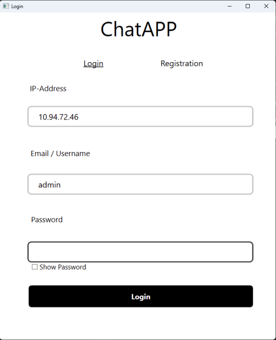
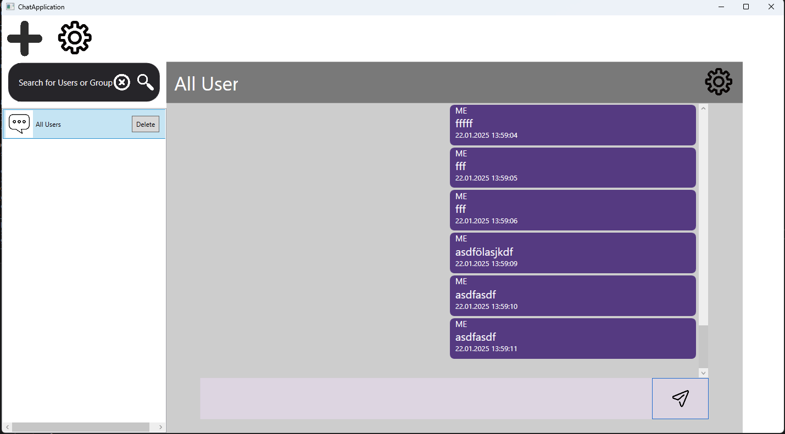
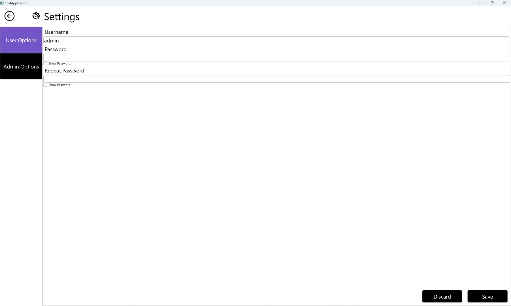
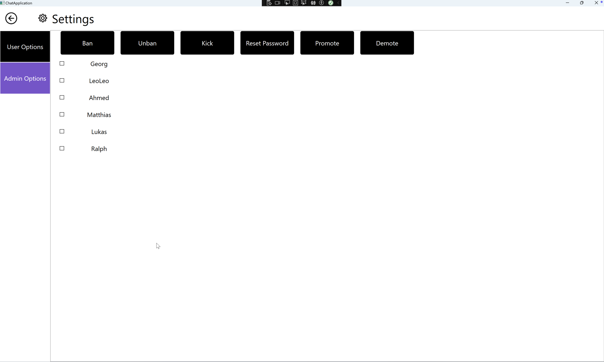

# Product Documentation
This file describes the functionality and features of the chatapplication developed by the project team during the team project.

## Startup
When the user starts the application, he get's sent to the Login Page.

## Login

The login page consists of several textboxes:
- IP-Address
- Email / Username
- Password

### IP-Address 
The Ip-Address is the IPv4 Address of the server you want to connect to.

### Email / Username
The textbox is used to select the account you want to login into. Here, either the username or the corresponding E-Mail address entered at the registration can be used.

### Password
In this input field, you need to enter the matching password of you user account. When pressing the "Show Password" checkbox the displaystyle of the currently inserted text in the password field gets changed to plain text instead of black circles. 

## Registration
The fields of the registration are mostly that same like in the login process. There are a few exceptions though.
- There are 2 password fields: 1 for the initial password and the second one to repeat it. There are also show password checkboxes.
- Entering an username *AND* an E-Mail is required.

## Chatwindow
When the login is complete, the user gets forwarded to main Chatwindow.

The Chatwindow has different Modules inside of itsself:
- Chat selection
- Searchbar
- User management + Chat creation

### Groups
As of right now, creating, maintaining and using groups with more than 2 users total are not supported yet. The is planned and the implementation is also very far already, but not finished yet. 

All users who are in the group can delete the group. An exception to this is the "All Users" group which can't be deleted. 

### Chat Selection
The chat selection is located on left hand side under the searchbar. Here are all currently open chats displayed. If you want to delete the chat there is a delete button next to each chat. All users inside a specific chat can delete that chat.

## Message Display
In the message display section, all messages of the currently selected chat are displayed. Each message displays it's sender, sent timestamp and the message itsself. The color design and formatting change based on if the message was sent by the currently logged in user or not.

#### Menu bar 
The menu bar within the message display is seen at the top. It's a gray bar with the chat name, users that are currently in the chat and a settings icon / button. 
Pressing the settings button opens a new window where the selected chat can be modified. Here the user can add and remove other users to and from the chat.

## User Management

The user management page allows users to change their login credentials and display name. They need to fill out the input fields and then press save changes. After clicking the save button, the credentials get updated. On the next login, the new login credentials can be used to login.

## Admin Options

The admin options page is only visible for admins and allows them to ban, unban, kick, promote, demote users and reset their passwords. All actions are performed the same way. An admin needs to select all users they want to edit and click on the button for the action they want.

### Ban / Unban
If an admin selects the users and bans them, the users get logged out and can't log in again until an admin unbans them.

### Kick
If an admin kicks a user the user gets disconnected simmilar to when they get banned, but the kicked user can just log in again.

### Promote / Demote
If an Admin wants to give a user admin privileges, he can promote them. An admin can also demote other admins back to users. An admin can not demote himself so the application cannot be left in a state without an admin.

### Reset Password
If an admin resets the password of another user the password gets set to the username and email of the user. 

For example:

Username: User \
Email: user@chatapp.at

gets set to:

Password: "Useruser@chatapp.at"

The admin can not reset his own password. For that he would have to use the users option page.
