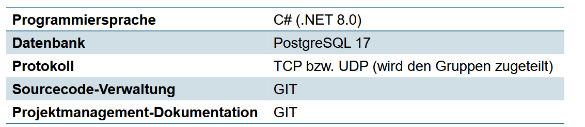

# Table of Conents
- [Table of Conents](#table-of-conents)
- [Roles](#roles)
- [Epics](#epics)
- [Conventions](#conventions)
	- [Project language](#project-language)
	- [1. Project Management Requirements](#1-project-management-requirements)
		- [1.1. What is a Minimum Viable Product (MVP)?](#11-what-is-a-minimum-viable-product-mvp)
		- [1.2. What is the Purpose of a Minimum Viable Product?](#12-what-is-the-purpose-of-a-minimum-viable-product)
	- [2. Design Requirements](#2-design-requirements)
	- [3. Technical Requirements](#3-technical-requirements)

# Roles
Product Owner(s): Cornelia Schneider, Nicole Hörbe \
Scrum Master: Leo Bruckner \
Project Developer(s): Georg Rohrhofer, Ahmed Othman, Ralph Lettner, Matthias Kuntner, Lukas Miehl

# Epics
1. Implementation of User Management
2. Sending and receiving of messages

# Conventions
## Project language
The main project language is English.

##  1. Project Management Requirements
- Agile PM
- Sprint planning in edu-git with issues
- Planning and Implementation in coordiantion with the Product Owners
- MVP on friday in week 1

###  1.1. What is a Minimum Viable Product (MVP)?

A minimum viable product, or MVP, is a product with enough features to attract early-adopter customers and validate a product idea early in the product development cycle. In industries such as software, the MVP can help the product team receive user feedback as quickly as possible to iterate and improve the product.

Because the agile methodology is built on validating and iterating products based on user input, the MVP plays a central role in agile development.

###  1.2. What is the Purpose of a Minimum Viable Product?
Eric Ries, who introduced the concept of the minimum viable product as part of his Lean Startup methodology, describes the purpose of an MVP this way: It is the version of a new product that allows a team to collect the maximum amount of validated learning about customers with the least amount of effort.

Ref: https://www.productplan.com/glossary/minimum-viable-product/

##  2. Design Requirements
- intuitive UI-design: include mockups
- Relational Database Design (min 3NF): ER-Diagram
- Class diagram (in Visual Studio)
- Flowcharts

##  3. Technical Requirements

- Follow common Software Design guidelines and principles \
- Follow coding conventions
- Proper UI-Design following designing principles
- include important security measures: 
    - don't store plain text passwords
    - be careful of SQL-injections
    - ...
- Source code documentation, commenting!

